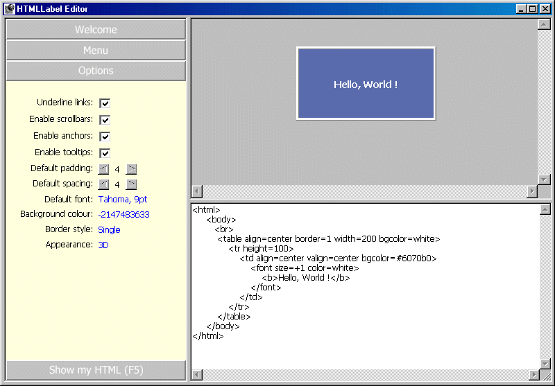



## HTMLLabel v0\.3\.0

### Description

The long-awaited, much-enhanced new release of THE all-VB HTML rendering control. Now with horizontal scrolling, table and cell background colours and much, much more.
 
### More Info
 

             |
---                |---
**Submitted On**   |2002-01-02 18:10:36
**By**             |[Woodbury Associates](https://github.com/Planet-Source-Code/PSCIndex/blob/master/ByAuthor/woodbury-associates.md)
**Level**          |Intermediate
**User Rating**    |4.9 (148 globes from 30 users)
**Compatibility**  |VB 6\.0
**Category**       |[Internet/ HTML](https://github.com/Planet-Source-Code/PSCIndex/blob/master/ByCategory/internet-html__1-34.md)
**World**          |[Visual Basic](https://github.com/Planet-Source-Code/PSCIndex/blob/master/ByWorld/visual-basic.md)
**Archive File**   |[HTMLLabel\_45794122002\.zip](https://github.com/Planet-Source-Code/woodbury-associates-htmllabel-v0-3-0__1-30318/archive/master.zip)

